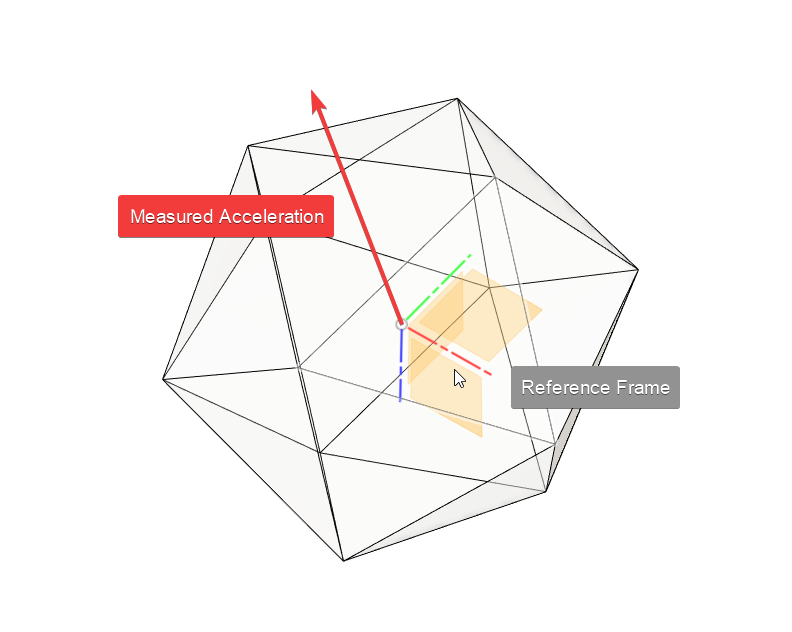
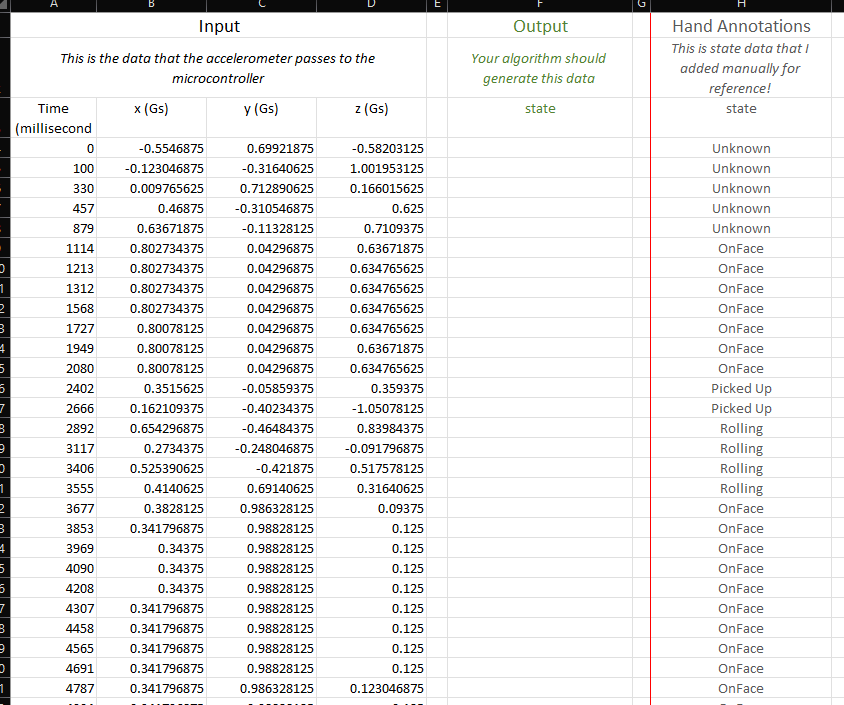
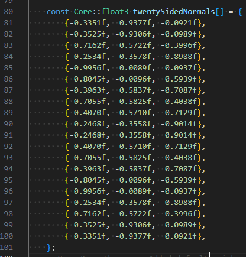
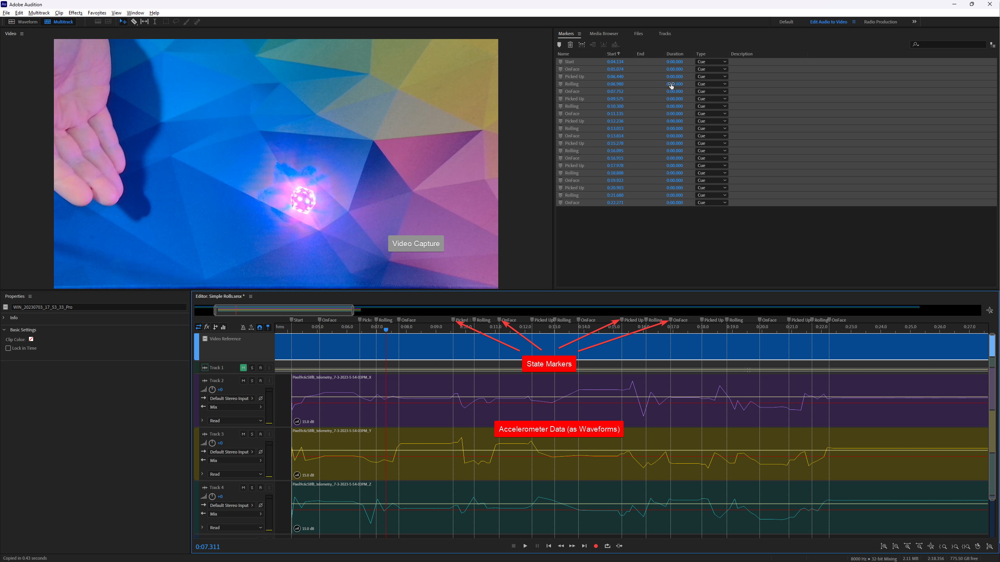

# Pixels Electronic Dice roll detection coding challenge
:source-highlighter: highlightjs
:icons: font
:toclevels: 3
:toc: auto

This is an entry to the coding challenge for the https://gamewithpixels.com[Pixels Electronic Dice] coding challenge for better roll detection.

## What are Pixels Electronic Dice and what is this project?

Pixels Electronic Dice are smart dice funded on https://www.kickstarter.com/projects/pixels-dice/pixels-the-electronic-dice[Kickstarter] and (at the time of writing) in a late stage of development.
They contain a number of electronic elements, including an accelerometer.
This accelerometer is used to detect the current state of the die.

However, at this point the detection accuracy isn't quite what it could be; while every actual roll is detected as such, currently many false positives are reported as well (e.g. when the dice are being moved on the table or picked up and put back down without being rolled).
On July 5th, 2023, Jean (founder of the Pixels project) started a coding challenge to tackle this problem.
The goal of this coding challenge is to write an algorithm in any modern programming language, that can be adapted for the firmware included in every die.

### Background information about the challenge

This information is copied from the https://discord.gg/9ghxBYQFYA[Pixels Dice Discord server], specifically from the https://discord.com/channels/732685261892223067/1125792003330936842[#coding-challenge-rules] channel.

#### How do Pixels know what they roll at all?
The dice use an Accelerometer.
The accelerometer periodically measures the acceleration felt by the die in 3D space (x,y,z) and sends that information over to the microcontroller for it to figure out the state of the die.
You can think of it as a constant stream of [time, x, y, z] values.

It may feel a little counter-intuitive at first, but this acceleration measurement includes the acceleration due to gravity: when the die is not moving, the accelerometer feels an acceleration of exactly exactly 1G (i.e. gravity).
And in fact, the direction in 3D space of this acceleration is how the dice can know which face is currently up.
By comparing the measured direction with the known direction of each face, the die can figure out which way it's facing.
This is the same principle that is used by phones and tablets to switch from portrait to landscape mode based on how you are holding them.



#### What is this challenge is focused on?

From the accelerometer's perspective, acceleration due to gravity and acceleration due to motion are indistinguishable, and so it is not trivial to know what a single measurement means.
In other words it is difficult for the die to know if the acceleration it is feeling at any point in time is due to the die being picked up by the user, the die being moved, put down, rolling or simply at rest on one of its faces.
However the die is working with a stream of measurements, not just one, and this is what can be used to make smarter decisions.

In short, this is what the challenge is about:

[.underline]#*Given a stream of [time, x, y, z] accelerometer readings, can you devise an algorithm that will estimate the state of the die at each time step?*#



#### What this is challenge is not focused on?

Decoding which face specifically the die is laying on is not a priority, as it is a solved issue.
Once we have determined that the die is at rest, retrieving which face is up is not particularly difficult.
The way the dice currently perform this is by comparing the measured acceleration vector to a table of canonical direction vectors corresponding to each face.
Attached is the firmware table that stores all 20 direction vectors for the D20.

I will be providing this table for reference, in case you want to use it as part of your algorithm, but it isn't important to how I will score your results.
I am much more interested in how you determine that the die is rolling or not, etc...



#### How will the data be provided?

Throughout the challenge, I will be providing annotated csv files and Video recordings.

The csv files will contain 5 columns:
[cols=5*]
|===
| Time (ms) | x (Gs) | y (Gs) | z (Gs) | state
|===
You are expected to ignore that last column in your algorithm, of course.
It is provided for reference.

Along with the csv files, I will provide recordings of the die rolls, with the accelerometer readings and annotations visible.
I found a clever way to generate those without needing to do a ton of editing work.
This will be useful when you want to cross-reference the csv data with the video of what happened to the die.



I'll most likely provide 2 or 3 files for each dataset:

* A csv file of the accelerometer readings, with manual state annotations
* A screen recording of the playback showing the accelerometer data in sync with a video of the die being rolled.
* (optionally) The Adobe Audition project files used to generate the screen recording (for those who have access to Audition, it will make scrubbing nicer).

#### Algorithm considerations

For this challenge, there is no programming language requirement, all you need to do is be able to read the input csv file, and generate output states.
There are, however, a few things you should keep in mind, as ultimately I will be adapting the best performing submission(s) to run on the dice's firmware.
This means a few things:

* Your code should be fairly self-contained.
You can't import a massive signal processing library that I would never be able to port to the small ARM CPU inside the dice.
Small libraries (such as vectors, matrix math, etc...) that you could reasonably re-write yourself are acceptable.
* Consider that the dice do not have access to a lot of RAM when you write your algorithm.
Try to avoid massive lookup tables or matrices.
* Your code can not look ahead!
Your algorithm is free to (and probably should) use as much past `[x,y,z]` data as you want, but it cannot look at future data when evaluating the die's current state.
In other words, when you compute `state[t]`, you can use:
+
--
 ** `x[t]`, `y[t]`, `z[t]`
 ** `x[t-1]`, `y[t-1]`, `z[t-1]`, `state[t-1]`
 ** `x[t-2]`, `y[t-2]`, `z[t-2]`, `state[t-2]`
 ** `x[t-3]`, `y[`...
 ** etc...
--
+
but you can not use:
+
--
 ** `x[t+1]`, `y[t+1]`, `z[t+1]`
 ** etc...
--
* This means that your code will often be delayed in its determining the die's state. That is unavoidable, and in fact part of the challenge: the sooner your code can make an accurate state inference, the better!
* Obviously you should be able to explain how/why your code works, either entirely in your source code, or in a separate post/document.

Generally speaking, you should have a primary method/function that looks something like this:
```
UpdateState(time, x, y, z) -> newState
```
In plain C, it would look something like this:
```c
enum State { ... }; // define your states
State UpdateState(int milliseconds, float x, float y, float z) {
    // Your logic here
}
```
This method would be called repeatedly from main() with a new line of data read from the csv file.

#### Datasets / Output States
I will be generating a number of datasets throughout the challenge time.
I will try to have a few separate files from the get go, but I want to listen to your suggestions and generate more data as necessary: "Throw the dice really hard!", "Roll it underwater!", etc... 🙂

As for what your algorithm should output, the requirement is to at least include the following states:

`Rolling`::
You have determined that the die is rolling.
The firmware code would use this state to play a continuous "rolling" led pattern for instance.
`OnFace`::
You have determined that the die is no longer moving.
In the firmware code, if the previous state was in fact rolling, then switching to this state would trigger a Roll event (i.e. play face-specific led pattern, send Bluetooth message, etc...).
`Handling`::
You have determined that the die is being handled by the user, and not actually rolling.

You are more than welcome to output more states than this (for instance `Crooked` or `Idle` or whatever makes sense to you) or to output more specific states than this (for instance `Rolling_InAir`, `Rolling_OnTable`, `Rolling_Collision`, `Handling_HighShake`, etc...) as long as I have enough information to trigger roll events or LED patterns.

#### Judging Submissions / Assigning Rewards

While I will do my best to primarily consider accuracy when judging your submission, please understand that it will still be a somewhat subjective process, as I will also be taking other factors into account.
I may value certain aspects of your code more or less than you do.
How difficult will it be for me to adapt your algorithm?
How memory and/or cpu efficient is your code?
How soon does your code detect a new state VS how accurate?
You get the idea.
Of course I will do my very best to explain my decisions when I announce the winners.

This number may change, but at the moment, I am planning to commit 3 devkits as rewards for this challenge:

* 2 devkits (2D20) for the submission I consider to be the best (again, subjectively)
* 1 devkit (1D20) for second place

#### Disclaimers

We do need to go over a couple things, just to be safe:

* I will be using the ideas / algorithms / code you provide to improve the firmware of the dice, and I may do this even if you don't win the challenge.
By participating in this challenge and providing your content, you authorize us to use it for commercial purposes with no payments or share of profits to be paid.
* On the flip side, you will not be liable for anything bad happening as a result of me using your code.
If somehow the new firmware I write as a result of using your code ends up hacking the phone of a CIA spy and stealing nuclear secrets, that's on me, not you! 🙂
* I will give you proper credit in the source code and anywhere else appropriate.
The code will happen to be public, as everything we make is, so if you do not want to be credited, you should let me know.

#### Video Walkthrough
I recorded a video trying to explain how the data works and what I'll be providing as data sets. I hope that helps understand things.

video::data/_general/Coding_Challenge_Walkthrough.webm[]

And here are the files I referenced in the walkthrough!

* link:data/dataset_01/Pixels_sample_rolls_1.csv[Pixels_sample_rolls_1.csv]
* link:data/dataset_01/2023-07-06_17-07-45.mkv[2023-07-06_17-07-45.mkv]
+
video::data/dataset_01/2023-07-06_17-07-45.mkv[]
* link:data/_general/Sample_Acceleration_Data_Parser.zip[Sample_Acceleration_Data_Parser.zip]

#### Second Dataset

Here is the second dataset, quite a bit longer than the previous one.

* link:data/dataset_02/Samples2.webm[Samples2.webm]
+
video::data/dataset_02/Samples2.webm[]
* link:data/dataset_02/Samples2.csv[Samples2.csv]

## Requirements

This project is written using Python 3.10, though any version of Python 3 should work.
If that is available, you can install all further requirements by running the following command within the link:src[] directory:

```src
# If pip is a Python 3 pip:
pip install -r requirements.txt
# Otherwise it's probably something like:
pip3 install -r requirements.txt
```

## How to run the code

Assuming you have a Python 3 installation available on your path as `python3`, you can run the following command:
[source, sh]
----
python3 src/start.py data/dataset_01/Pixels_simple_rolls_1.csv --output output/output.csv
----

Alternatively you can run this in Docker without having to install any Python dependencies:
[source, sh]
----
# This first line only has to be run once
docker build . -t pixels-roll-detect
docker run -it \
           -v "$PWD/data:/tmp/data" \
           -v "$PWD/output:/tmp/output" \
           pixels-roll-detect \
           /tmp/data/dataset_01/Pixels_simple_rolls_1.csv \
           --output /tmp/output/out.csv
----
Let's look at that second command in some detail.
[source, sh]
----
docker run -it \ #<1>
           -v "$PWD/data:/tmp/data" \ #<2>
           -v "$PWD/output:/tmp/output" \ #<3>
           pixels-roll-detect \ #<4>
           /tmp/data/dataset_01/Pixels_simple_rolls_1.csv \ #<5>
           --output /tmp/output/out.csv #<6>
----
<1> This calls Docker and tells it to run a command in _interactive_ mode and with a pseudo-TTY; this basically means that you can give input via command line (relevant if you leave out the output file).
<2> The path `"$PWD/data:/tmp/data"` means, that the path `data` within the present working directory will be available as the path `/tmp/data` within the Docker container. If you do not want to use the local path `data` but instead a different data directory, you can change that setting. Also, the `$PWD` part is compatible with unixoid systems (e.g. macOS and Linux) and will probably not work on Windows; try using `%cd%` on Windows instead.
<3> Similar to the prior part, this determines that an output directory will be available under `/tmp/output` within the Docker container and that will map to the local path `output` within the current working directory. And again, on Windows systems you probably want to switch `$PWD` for `%cd%`.
<4> This is the name of the Docker image built from the link:Dockerfile[] via the command `docker build . -t pixels-roll-detect`. You can change the name of the image in that first command e.g. if it may conflict with other Docker images; in that case you also have to change it here.
<5> This defines the input file to be used. Since we mapped the directory local `data` to the directory `/tmp/data` within the Dockerfile in the second line of this command, the file `/tmp/data/dataset_01/Pixels_simple_rolls_1.csv` will correspond to the local file `data/dataset_01/Pixels_simple_rolls_1.csv` (which is included in this repository). If you want to use a different input file, this is the place to change that.
<6> This is the definition of the output file, which you can rename as you choose. It lies in the directory `/tmp/output` within the Docker image, which (according to the third line of this command) maps to the local directory `output` (included in this repository, but empty except for a `.gitignore` file). If you want to rename the output file, this is the place to do so. Also, this command is optional; if not given, you will be prompted for an output file path.

## How the code works

TODO
